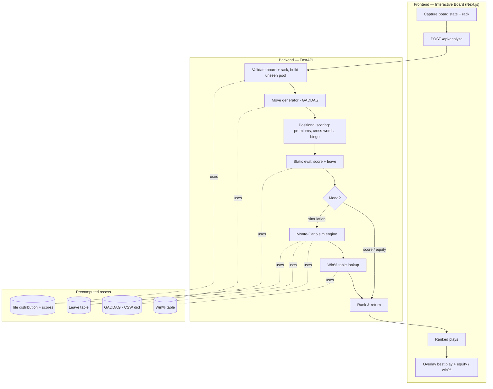

# Best-Play Simulation Engine — Planning Doc

> Goal: from a **replicated board state + your rack**, have the system run **optimized
> simulations** to recommend the **best move**, accounting for the letters you hold, the
> letters on the board, and **the value of what you might draw next turn** (looking ahead).
>
> In the literature this is a **Maven/Quackle-class Scrabble AI**. This document grounds
> the design in the research, then lays out an incremental plan to build it into this
> project (FastAPI backend + Next.js interactive board).

---

## 1. What we're really building

The current [scrabble_engine.py](scrabble_engine.py) answers *"what words can I make from these
letters?"* using an anagram-signature index. The requested feature is a different, much
harder problem:

> Given the **full 15×15 board** and my **rack**, find the play that **maximizes my chance
> of winning the game**, not just this turn's score — because a slightly lower-scoring play
> that keeps a great rack (e.g. retaining `S`, a blank, or `ER`) is often better.

That requires four capabilities the current engine lacks:

1. **Legal move generation on a real board** — plays must hook onto existing tiles and form
   valid *cross-words*, not just contiguous insertions.
2. **Positional scoring** — premium squares (only when freshly covered), cross-word scores,
   the 50-point bingo bonus.
3. **Evaluating the future** — the worth of the tiles left on the rack ("**leave**") and the
   distribution of tiles we might draw.
4. **Simulation (look-ahead)** — rolling the game forward a couple of plies over many
   random tile draws to estimate each candidate's **equity** and **win %**.

---

## 2. Background & literature (grounded)

| Component | Key work | Idea we use |
|-----------|----------|-------------|
| Move generation (DAWG) | Appel & Jacobson, *"The World's Fastest Scrabble Program"*, CACM 1988 | Dictionary as a DAWG; anchors + cross-checks generate legal plays fast |
| Move generation (GADDAG) | **Gordon, *"A Faster Scrabble Move Generation Algorithm"*, SPE 1994** | Store every **reversed prefix + suffix** so you can grow a word *outward* from any board letter ("hook"). ~2× faster than DAWG, ~5× the space. Used by Quackle |
| The whole AI | **Sheppard, *"World-championship-caliber Scrabble"*, Artificial Intelligence 134 (2002)** — Maven | Three regimes: **mid-game** (move-gen + **simulation**), **pre-endgame**, and **endgame**. Coined "many looks ahead of only 2 moves" |
| Static evaluation & leaves | **Katz-Brown & O'Laughlin, *"How Quackle Plays Scrabble"*** | Static value = `score + leave`. Leaves are a **precomputed table** (1–6 tiles) learned from millions of self-play games; high for racks that set up bingos |
| Simulation | Maven / Quackle | For each of the top ~23 candidates, run **~300 rollouts** of *(my play → opponent's best static reply → my best static reply → my leave)*; average the result |
| Win probability | Quackle | Convert final **spread** + **tiles remaining** into `P(win)` via a table learned from self-play; essential when chasing/protecting a lead |
| Opponent inference | **Richards & Amir, *"Opponent Modeling in Scrabble"*, IJCAI 2007** | Infer the opponent's likely rack from the play they just made; sharpens the unseen-tile distribution |
| Endgame | Sheppard 2002 | Once the bag is empty the game is **perfect information** → solve exactly with **B\*** / minimax + α-β |
| Imperfect-info search | Cowling et al., *Information Set MCTS* (2012); Frank & Basin (1998) on **strategy fusion** | Generalizations of "sample the hidden state, search, aggregate"; PIMC's known weakness (strategy fusion) to be aware of |
| Learning-based eval | *Evaluation Function Approximation for Scrabble* — [arXiv:1901.08728](https://arxiv.org/abs/1901.08728) | Learn the static eval / leaves via self-play instead of hand-tuning |
| Bluffing / mixed strategy | *Bluffing in Scrabble* — [arXiv:2509.10471](https://arxiv.org/abs/2509.10471) (2025) | Phonies and randomized strategy can be optimal under imperfect information |
| Modern engine | **Macondo / MAGPIE** (woogles.io, C. Del Solar) | Open-source, fast C move generator + exact endgame solver; reference data formats (KWG/KLV) |

**Takeaway:** the state of the art for *practical, strong* play is still **truncated
Monte-Carlo simulation over a strong static evaluator** (Maven/Quackle), with exact search
only in the endgame. Neural/AlphaZero-style methods exist for imperfect-information games
but are not yet clearly superior for Scrabble and are far heavier to train. **We target the
Maven/Quackle design**, with an optional ML leave-estimator later.

---

## 3. The math

**Static evaluation (equity).** For a candidate play $m$ from rack $r$:

$$Q_\text{static}(m) = \text{score}(m) + L\big(\text{leave}(m)\big)$$

where $\text{leave}(m)$ is the multiset of tiles left after playing $m$, and $L(\cdot)$ is the
learned **leave value** — an estimate of the future scoring advantage of holding those
tiles. $L$ is *exactly* the "chances of getting better letters next turn" encoded as a
number (e.g. $L(\text{ER}) \approx +4.8$, $L(\text{ERRR}) \approx -9$ in Quackle's table).

**Simulation (2-ply rollout).** For candidate $m$, sample $N$ rollouts. In rollout $i$:

1. Play $m$ (score $s_0$, leave residue).
2. Draw the opponent a rack from the **unseen pool** $U$; they play their best *static* move $s_1^{(i)}$.
3. Refill our rack from $U$; we play our best *static* move $s_2^{(i)}$, then add our final leave $\ell^{(i)}$.

The rollout's spread differential is

$$\Delta_i(m) = \big(s_0 + s_2^{(i)} + \ell^{(i)}\big) - s_1^{(i)}$$

and the simulated value / win estimate are

$$\hat{V}(m) = \frac{1}{N}\sum_{i=1}^{N}\Delta_i(m), \qquad
\hat{W}(m) = \frac{1}{N}\sum_{i=1}^{N} P_\text{win}\!\big(\text{spread}_i,\ \text{tiles left}_i\big).$$

**Unseen pool.** With standard English tiles (100 total), the pool we sample from is

$$U = \text{Bag} \cup \text{Opponent rack}, \qquad |U| = 100 - (\text{tiles on board}) - |\text{my rack}|.$$

We sample opponent racks and our future draws from $U$ **without replacement** (optionally
re-weighted by opponent inference, §5).

**Explicit "future draw" model (what the leave approximates).** For residue $\rho$ we can
compute directly, over draws of $k = 7-|\rho|$ tiles from $U$:

$$P(\text{bingo next turn}\mid\rho) = \frac{\#\{\text{draws that complete a 7-tile word}\}}{\binom{|U|}{k}},$$

estimated by sampling. This gives an interpretable companion to $L(\rho)$.

**Stopping rule (optimized simulation).** Track each candidate's standard error
$\text{SE}(m)=\hat\sigma(m)/\sqrt{N_m}$ and **prune** candidates whose upper confidence bound
falls below the leader's lower bound (a UCB/racing scheme), spending iterations where they
change the answer. This is the "optimized" in *optimized simulations* — Sheppard's
"selective simulation."

---

## 4. Target architecture



### 4.1 Board & move model
- 15×15 grid; each cell = empty, or a placed tile `{letter, isBlank}`.
- Premium-square layout already exists in [frontend/components/scrabble-board.tsx](frontend/components/scrabble-board.tsx) — lift the same layout server-side.
- **Cross-checks**: for each empty square, precompute the set of letters that form a legal
  down/across cross-word (Appel-Jacobson). This is what makes move-gen fast and correct.
- A **Move** = `{tiles: [{row,col,letter,isBlank}], mainWord, crossWords, score, leave}`.

### 4.2 Move generation (the hard part)
- Build a **GADDAG** from the CSW word list we already ship
  ([Collins Scrabble Words (2019).txt](Collins%20Scrabble%20Words%20(2019).txt)).
- Generate from **anchor squares** (empty squares adjacent to existing tiles; the center for
  the opening move), extending left/right (or up/down) using the GADDAG and honoring
  cross-checks + rack (including blanks).
- **Performance reality:** a pure-Python GADDAG is fine for a *single* position (tens of ms)
  but **too slow inside simulation** (≈ candidates × iterations × 2 plies ≈ 10⁴ move-gens per
  analysis). Plan: Python first for correctness, then a **compiled move generator** (Rust via
  PyO3, or bind Macondo/MAGPIE) for the simulation phase.

### 4.3 Leave values
- Options, cheapest → best:
  1. **Import** an existing leave table (Quackle superleaves / Macondo KLV) — *verify license*
     before bundling.
  2. **Bootstrap our own** via self-play: play greedy games, regress each leave onto the
     realized future spread, iterate (this is the [arXiv:1901.08728](https://arxiv.org/abs/1901.08728) idea and
     avoids licensing questions).
- Store as a compact `leave → float` map (1–6 tiles).

### 4.4 Simulation engine
- Candidates = top ~15–23 plays by static eval.
- Per candidate: 2-ply rollouts sampling from the unseen pool; opponent and self-reply use
  the fast static evaluator (one move-gen each).
- **Time-budgeted** (e.g. 2–5 s) with the racing/early-stop rule (§3) and **parallelism**
  (process pool or a worker service). Report iterations run + standard error so the UI can
  show confidence.

### 4.5 Win% + endgame
- Win% table keyed by `(spread, tiles-remaining)` from self-play.
- **Pre-endgame / endgame**: when the bag is small/empty, switch from sampling to (near-)exact
  search — the endgame is perfect information and solvable with minimax + α-β / B\*.

---

## 5. Modeling the future & the opponent

- **Tile tracking**: `unseen = full distribution − tiles on board − my rack`. This is the base
  for every draw/opponent sample.
- **Opponent inference** (Richards & Amir 2007, *optional, later*): after the opponent's move,
  down-weight racks inconsistent with a strong player having *not* made a better play; sample
  opponent racks from this posterior instead of uniform. Improves defensive/blocking decisions.
- **Bluffing / phonies** ([arXiv:2509.10471](https://arxiv.org/abs/2509.10471)): out of scope for v1 (we only
  recommend valid words), but noted as a genuine part of optimal play under imperfect info.

---

## 6. API contract (proposed)

`POST /api/analyze`

```jsonc
// request
{
  "board": [[null, {"letter":"C","blank":false}, /* …15 cells… */]],  // 15×15, null = empty
  "rack": "AEINRST",              // '?' = blank
  "options": {
    "mode": "score" | "equity" | "simulation",   // increasing strength/cost
    "timeBudgetMs": 3000,
    "maxCandidates": 15,
    "opponentRack": null,          // usually unknown
    "tilesInBagOverride": null     // testing only
  }
}
```
```jsonc
// response
{
  "mode": "simulation",
  "unseen": { "tilesInBag": 52, "counts": { "A": 6, "…": 0 } },
  "plays": [
    {
      "word": "NASTIER", "direction": "across",
      "tiles": [{"row":7,"col":7,"letter":"N","blank":false}, /* … */],
      "score": 74, "leave": "", "equity": 74.0,
      "winPct": 0.61, "iterations": 180, "stdErr": 1.1,
      "crossWords": ["ON", "…"]
    }
  ]
}
```

Backend guardrails (reuse the Phase-2 pattern): validate the 15×15 shape, rack length/blanks,
cap `timeBudgetMs`/`maxCandidates`, and rate-limit (simulation is expensive).

---

## 7. Frontend UX

The [Interactive Board](frontend/components/scrabble-board.tsx) already lets a user place
tiles. Extend it to:
- Distinguish **board tiles** (permanent, form the position) from **rack tiles**; add a blank
  designator.
- An **"Analyze"** button → `POST /api/analyze` with a mode toggle (Score / Equity / Simulate).
- A **results panel**: ranked plays with score, equity, win %, and confidence; hovering a play
  **overlays** it on the board (ghost tiles); a "why" tooltip shows the leave and its value.
- A **live tile tracker** (unseen counts) — genuinely useful on its own and reuses the pool.

---

## 8. Phased roadmap

| Phase | Deliverable | Notes |
|-------|-------------|-------|
| **A. Board model + legal move-gen** | Correct plays on a real board (anchors, cross-checks, blanks) | GADDAG in Python; validate against known positions |
| **B. Positional scoring** | Premiums (fresh only), cross-words, bingo bonus | Golden tests vs the Wikipedia scoring example |
| **C. Static eval (equity)** | `score + leave` ranking; `/api/analyze?mode=equity` | Import or bootstrap leaves |
| **D. Simulation** | 2-ply Monte-Carlo, unseen sampling, win%, early-stop; `mode=simulation` | Needs the **compiled** move-gen for speed; parallelize |
| **E. Frontend integration** | Board capture, analysis overlay, tile tracker | Ship the visible feature |
| **F. Endgame + inference (stretch)** | Exact endgame solver; opponent inference; ML leaves | Strength polish |

Phases A–C give a genuinely useful "best play by equity" tool quickly; D is where "optimized
simulations / predicting the future" fully lands.

---

## 9. Risks & mitigations

| Risk | Mitigation |
|------|------------|
| **Move-gen too slow in Python for simulation** | Prototype in Python; move the hot path to Rust/PyO3 or bind Macondo/MAGPIE for Phase D |
| **Leave-data licensing** (Quackle GPL) | Bootstrap our own leaves via self-play; keep third-party data optional/attributed |
| **Simulation variance vs. latency** | Time budget + UCB early-stopping; report confidence; cache move-gen per position |
| **PIMC strategy fusion** (Frank & Basin) | Acknowledge; keep 2-ply + strong static eval (Maven-proven); consider IS-MCTS later |
| **Correctness of scoring/cross-words** | Extensive golden tests, including double-double/triple-triple and multi-cross-word plays |
| **Dictionary drift** (CSW19 vs newer) | Make the lexicon a configurable, versioned asset |

## 10. Success metrics
- **Correctness:** move generator + scorer match reference positions/tools exactly (test suite).
- **Strength:** simulation player beats the greedy "highest-score" baseline by a large margin in
  self-play (measured in average spread / win %), and stays close to Quackle where comparable.
- **Latency:** interactive analysis within the configured budget (e.g. a useful answer in ≤ 3 s;
  static equity in < 100 ms).
- **Feature parity with the ask:** board replicated → ranked plays with score, **equity**, and
  **win %** that visibly account for the rack leave and future draws.

## 11. References
- Appel & Jacobson, *The World's Fastest Scrabble Program*, CACM 31(5), 1988.
- Gordon, *A Faster Scrabble Move Generation Algorithm*, Software: Practice & Experience 24(2), 1994 — [PDF](http://www.ericsink.com/downloads/faster-scrabble-gordon.pdf).
- Sheppard, *World-championship-caliber Scrabble*, Artificial Intelligence 134(1–2), 2002 — [doi:10.1016/S0004-3702(01)00166-7](https://doi.org/10.1016/S0004-3702(01)00166-7).
- Katz-Brown & O'Laughlin, *How Quackle Plays Scrabble* — [doc](http://people.csail.mit.edu/jasonkb/quackle/doc/how_quackle_plays_scrabble.html); Quackle source: [github.com/quackle/quackle](https://github.com/quackle/quackle).
- Richards & Amir, *Opponent Modeling in Scrabble*, IJCAI 2007.
- Cowling, Powley & Whitehouse, *Information Set Monte Carlo Tree Search*, IEEE TCIAIG, 2012.
- Frank & Basin, *Search in games with incomplete information* (strategy fusion), Artificial Intelligence, 1998.
- *Evaluation Function Approximation for Scrabble* — [arXiv:1901.08728](https://arxiv.org/abs/1901.08728).
- *Bluffing in Scrabble* — [arXiv:2509.10471](https://arxiv.org/abs/2509.10471).
- Macondo / MAGPIE (modern open-source engine, woogles.io) — [github.com/domino14/macondo](https://github.com/domino14/macondo).

See [task.md](task.md) for where this fits in the overall roadmap.
