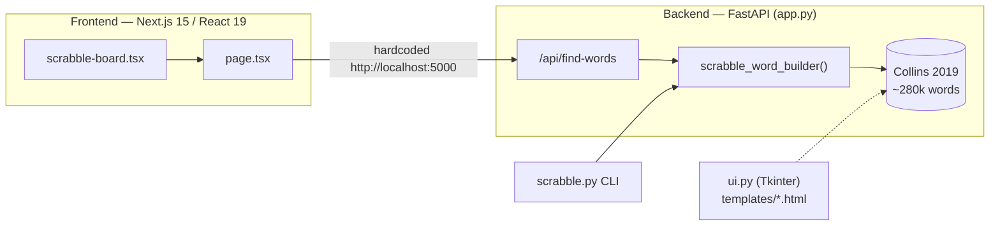
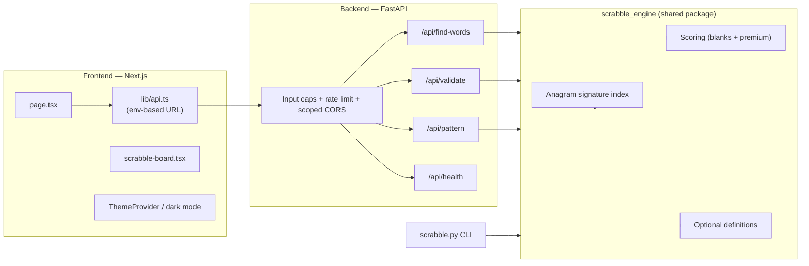

# Scrabble Word Builder — Improvement Plan

> A strategic roadmap to evolve this project from a working prototype into a fast,
> correct, secure, and genuinely delightful word-game companion.

---

## 1. Executive Summary

The Scrabble Word Builder is a full-stack app (FastAPI + Next.js) that generates all
valid words from a set of letters. The foundation is solid — modern frontend stack,
Docker packaging, a real 280k-word Collins dictionary — but the project is held back by
a brute-force core algorithm, a handful of correctness bugs, "Flask vs FastAPI"
documentation drift, and the absence of tests and safety rails.

This plan reframes the app around a **single fast word engine** and layers on
**correctness, security, testing, and a set of creative features** that turn a simple
"anagram finder" into a strategic Scrabble assistant.

---

## 2. Current State Assessment

### 2.1 Architecture (as-is)

### 2.2 What works well

- Clean, modern frontend (Tailwind + shadcn/ui + Radix), responsive layout.
- Real dictionary with correct Scrabble letter scores.
- Working Docker Compose setup with health checks and a non-root frontend user.
- Interactive 15×15 board with an accurate premium-square layout.

### 2.3 Pain points (evidence-based)

| # | Area | Finding | Impact |
|---|------|---------|--------|
| P1 | Algorithm | `scrabble_word_builder` enumerates `itertools.permutations` → **O(n!)** | Slow; DoS risk |
| P2 | Correctness | Multiple blank tiles all collapse to the **same** replacement letter | Wrong/missing results |
| P3 | Correctness | Blank `zero_indices` computed *before* board letters are inserted → misaligned | Wrong scores |
| P4 | Correctness | Mutable default argument `zero_indices=[]` | Latent bug |
| P5 | DRY | Engine duplicated verbatim in `app.py` and `scrabble.py` | Drift risk |
| P6 | Docs drift | README/compose/scripts say **Flask**, but code is **FastAPI** | Confusion |
| P7 | Config | Two Next configs (`next.config.js` vs `.mjs`) with different behavior | Broken Docker build |
| P8 | Config | Frontend hardcodes `http://localhost:5000`, ignoring `NEXT_PUBLIC_API_URL` | Breaks in prod/proxy |
| P9 | Security | `CORS allow_origins=["*"]` **with** `allow_credentials=True` | Invalid/insecure |
| P10 | Security | No input-length cap or rate limit on an O(n!) endpoint | DoS vector |
| P11 | Quality | No automated tests, no CI | Regressions |
| P12 | UX | Errors only `console.error`; `loading.tsx` is a no-op; metadata still "v0 App" | Poor UX/SEO |
| P13 | Dead code | `ui.py` is a non-functional stub; redundant `*_COMPLETE.md` docs | Clutter |

---

## 3. Vision & Guiding Principles

**Vision:** *"Type your rack, instantly see every play — ranked, defined, and
board-aware."*

Guiding principles:

1. **One engine, many faces.** A single, well-tested Python module powers the API, the
   CLI, and any future surface. No copy-paste logic.
2. **Fast by construction.** Replace factorial enumeration with an anagram-signature
   index so lookups scale with *combinations*, not *permutations*.
3. **Correct first, clever second.** Fix blank-tile and scoring bugs before adding
   features; guard every fix with a test.
4. **Safe by default.** Bound inputs, scope CORS, and rate-limit before exposing
   anything publicly.
5. **Honest docs.** The README describes what the code actually does.

---

## 4. Target Architecture

**Core engine idea (signature index):** precompute a dictionary mapping the *sorted
letters* of every word to the list of words that share them, e.g.
`"AEHRSTW" → ["THAWERS", "WREATHS", ...]`. Finding words then becomes: for each
combination of the rack, look up its signature — turning an O(n!) scan into a handful
of O(1) dictionary hits.

---

## 5. Roadmap (Phased)

### Phase 0 — Truth & Hygiene *(fast wins)*
Align reality and docs; remove ambiguity.
- Fix Flask→FastAPI wording in README, compose env, root `package.json`, scripts.
- Resolve the duplicate Next config; make the frontend URL env-driven.
- Set real page metadata; remove/junk dead code (`ui.py`, redundant docs).

### Phase 1 — Core Engine & Correctness
- Extract a shared `scrabble_engine` package used by API + CLI.
- Replace permutations with an **anagram-signature index**.
- Fix multi-blank support and blank-aware scoring; kill the mutable default arg.
- Add a golden set of unit tests locking in correct behavior.

### Phase 2 — Security & Robustness
- Scope CORS to known origins; drop the invalid credentials+`*` combo.
- Cap input length (rack ≤ e.g. 10, blanks ≤ 2) and return 422 with a clear message.
- Add lightweight rate limiting.
- Real frontend error + empty states; make `loading.tsx` meaningful.

### Phase 3 — Testing & CI
- `pytest` for the engine and API; `vitest` (or Playwright) smoke test for the UI.
- GitHub Actions: lint, type-check, test, and `docker build` on every PR.
- Add `.env.example` and document configuration.

### Phase 4 — Creative Features
- **Pattern / wildcard search** (`C_T`, `*ING`, `.A.E`).
- **Word validator** endpoint + "is this a word?" UI with definitions.
- **Premium-square-aware scoring** on the interactive board (compute real play value).
- **Random rack generator** and **word of the day**.
- **Filters & sorting** (length, score, alphabetical, must-contain).
- **Favorites & search history** (localStorage), copy/share results.

### Phase 5 — Polish & Delight
- Dark mode (wire up existing `ThemeProvider`), keyboard-first UX, a11y pass.
- Result virtualization for large word lists; subtle animations.
- Optional PWA/offline support with a bundled compact dictionary.

---

## 6. Cross-Cutting Concerns

- **Performance budget:** a 7-letter rack query should return in well under 100 ms
  server-side after the signature index lands.
- **Accessibility:** keyboard navigation, focus states, and ARIA labels on the board.
- **Observability:** structured logs and a richer `/api/health` (word count, version).
- **Configuration:** all URLs/ports/limits via environment variables, documented.

---

## 7. Risks & Mitigations

| Risk | Mitigation |
|------|------------|
| Refactor changes results subtly | Lock behavior with golden tests **before** refactoring |
| Signature index memory footprint | Measure; dictionary is ~280k words — comfortably in RAM |
| Feature creep delays fixes | Phases 0–2 are non-negotiable and ship before Phase 4 |
| Dictionary licensing for definitions | Use a permissive source or on-demand free API with caching |

---

## 8. Success Metrics

- ✅ 7-letter query latency: **< 100 ms** server-side (from seconds today for hard racks).
- ✅ **0** known correctness bugs for blanks/scoring (covered by tests).
- ✅ **> 80%** engine test coverage; green CI on every PR.
- ✅ README matches implementation; single source of truth for config.
- ✅ At least **3** new user-facing features shipped (pattern search, validator, dark mode).

---

## 9. Deliverables

- A shared, tested `scrabble_engine` package.
- A hardened, documented FastAPI service.
- A polished, env-configurable frontend with new features.
- CI pipeline and accurate documentation.

See [task.md](task.md) for the concrete, trackable breakdown of this plan.
